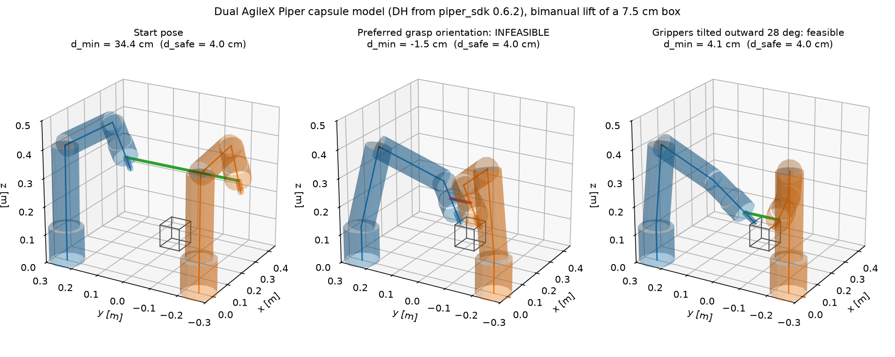
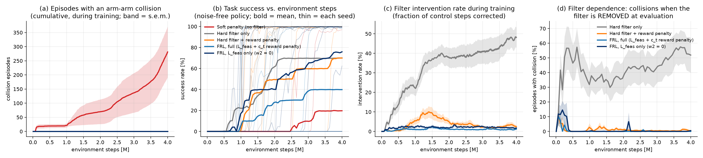
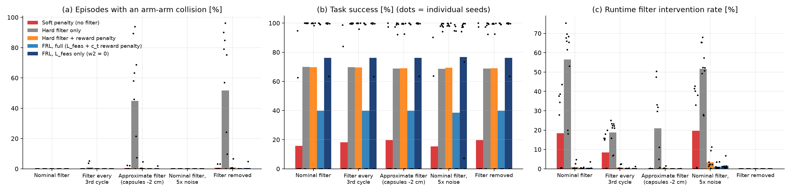
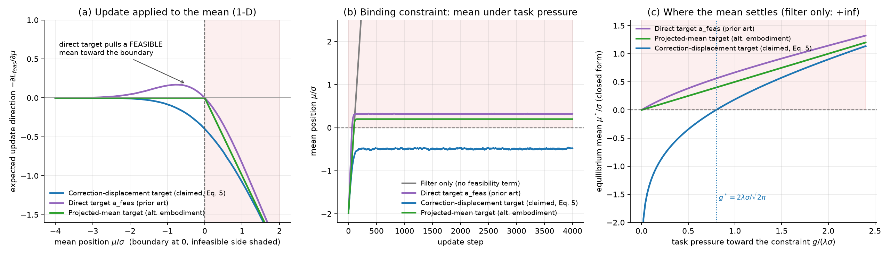
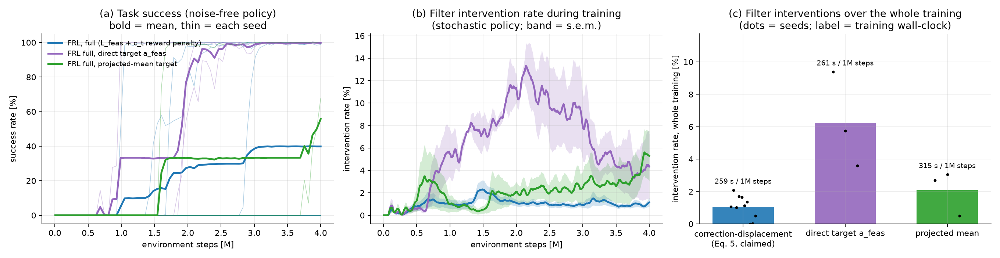

# FRL for dual-arm robots: experimental validation

This repository contains the experiments behind the patent application
**"Method and System for Training a Dual-Arm Robot Using Filter-guided Reinforcement Learning"**
(D. A. Pham, K. K. Ahn). They answer the Round-2 pre-filing review
(Section B: comparative evidence, Section C: the bias argument for Eq. 5).

The robot model is the dual **AgileX Piper** rig of the reference project
[`dk2472780158-ctrl/piper-dual-arm-act-towel-folding`](https://github.com/dk2472780158-ctrl/piper-dual-arm-act-towel-folding):
its kinematics come from the Piper SDK (`piper_sdk==0.6.2`) and its joint limits from the project's safety layer.
The whole method (Eqs. 1-12, Algorithm 1) is implemented from scratch in PyTorch and runs on a CPU.

## Summary of the evidence

Results on the dual-Piper cooperative box lift. Main methods: 10 seeds x 4 M steps each.
Deployment: 1000 episodes per seed and condition.

| | Soft penalty | Hard filter only | Filter + reward penalty (prior art) | **FRL, L_feas only** | **FRL, full** |
|---|---|---|---|---|---|
| Training episodes with an arm-arm collision (per run) | **281 ± 285** | 0 | 0 | **0** | **0** |
| Seeds that solve the task within 4 M steps | 2/10 | 7/10 | 7/10 | **7/10** | 4/10 |
| Filter interventions over the whole training | - | 33.1% | 3.8% | **2.1%** | **1.1%** |
| *Solved seeds:* runtime filter intervention of the frozen policy | - | 50.6% | 0.6% | **0.1%** | **0.1%** |
| *Solved seeds:* collision episodes after the filter is **removed** | 0 / 2000 | 2845 / 7000 | 86 / 7000 | **0 / 7000** | **1 / 4000** |
| *Solved seeds:* steps inside the 4 cm margin after the filter is removed | 47.0% | 50.2% | 2.5% | **0.2%** | **0.3%** |
| *Solved seeds:* collision episodes with an **approximate** filter (capsules 2 cm too thin) | 0 / 2000 | 2496 / 7000 | 59 / 7000 | **0 / 7000** | **0 / 4000** |

In short:
* **FRL trains without a single collision.** The soft-penalty baseline collides in hundreds of
  episodes per run, and it solves the task in only 2 of 10 seeds.
* **FRL removes the filter dependence of the hard-filter method.** Among the seeds that solve the
  task, the filter-only policy needs the filter in 51% of control steps and collides in 41% of the
  episodes once the filter is removed. The FRL policy needs the filter in 0.1% of steps and has
  0 collisions in 7000 episodes.
* **FRL beats the closest prior art on filter reliance.** The comparison is against the reward-penalty
  baseline (the Wabersich & Zeilinger-style correction penalty). Among solved seeds, the
  feasibility-consistency term alone gives 0 vs. 86 collision episodes once the filter is removed
  (seed-level permutation test p = 0.021), and 0.2% vs. 2.5% of steps inside the margin (p = 0.0006).
  Both reach the same number of solved seeds.
* **The correction-displacement target of Eq. (5) is the right target.** It is the only target whose
  equilibrium mean stays feasible under task pressure (closed form). In the dual-arm task it needs
  about 5x fewer filter interventions during training than the direct target `a_feas` (1.1% vs. 6.2%).
* **Honest limitation.** FRL does **not** make the task itself faster to learn than the other
  filter-based methods. Success within 4 M steps is dominated by an exploration local optimum
  that all methods share (Section 5). Adding the reward penalty on top of `L_feas` (FRL, full) did
  not help here.

Three results support the claimed effects:

| # | Claimed effect (specification) | Experiment | Outcome |
|---|---|---|---|
| 1 | Training is collision-free from the first step and sample-efficient; the policy learns to propose feasible actions and needs the filter less over time ("Effects of the invention", last paragraph of the Detailed Description) | Training benchmark against a soft-penalty baseline, a filter-only baseline and a filter + reward-penalty baseline (Review B) | FIG. 1, Table 1, Table 4 |
| 2 | At deployment the retained filter is only a lightweight safeguard, so the system tolerates a filter that is removed, delayed or approximated (Stage C, claims 9 and 11) | Frozen policies under 5 runtime-filter conditions, 1000 episodes per seed and condition | FIG. 2, Table 2 |
| 3 | The correction-displacement target of Eq. (5) removes the noise bias of a target projected from the sampled action (Review C, claim 1) | Closed-form and Monte-Carlo analysis, plus an ablation of the target form in the dual-arm task | FIG. 3a, FIG. 3b, Table 3 |

---

## 1. Where each element of the specification lives in the code

| Specification element | Eq. / claim | Implementation |
|---|---|---|
| Raw task-space action: displacement and rotation of each gripper | Eq. (1), claim 14 | `frl/ppo.py`, `ActorCritic` (Gaussian policy with a learned state-independent std) |
| Damped-least-squares differential IK; hold the current configuration when there is no solution | Eq. (2), claim 19 | `frl/safety_filter.py`, `ActionPipeline.inverse_kinematics` (joint-limit aware) |
| Per-step motion bound below `d_safe / 2` for path safety | claim 20 | `ActionPipeline.enforce_motion_bound` (exact maximum over each rigid capsule segment) |
| Capsule model and closed-form capsule-to-capsule distance | Eq. (3), claims 2 and 13 | `frl/collision.py`, `segment_closest_points`, `ArmArmDistance` |
| Feasibility test `d_min(q_des) >= d_safe` | Eq. (3) | `ActionPipeline.project` |
| Iterative linearised projection along `W^-1 grad d_min` with an iteration cap and a fallback to the current configuration | Eq. (4a), claims 3 and 18 | `ActionPipeline.project`; the analytic gradient comes from the closest-point pair and the link Jacobians (`ArmArmDistance.dmin_and_grad`) |
| FK back-mapping to a task-space corrected action | Eq. (4b) | `ActionPipeline.back_map` |
| Feasibility-consistency loss: target `sg(mu + a_feas - a_raw)`, applied to the mean, masked by `m_t` | Eq. (5), claims 1 and 4 | `frl/ppo.py`, `train`, `target_mode == "corr_disp"` |
| Actor objective `L_clip + lambda_feas * L_feas`; the critic gets no feasibility term | Eqs. (6) and (10), claim 5 | `frl/ppo.py`, `train` |
| Clipped surrogate with the ratio evaluated on the raw action | Eqs. (7)-(8), claims 6 and 21 | `frl/ppo.py`, `train` |
| Truncated GAE with a value bootstrap | Eq. (9) | `frl/ppo.py`, `train` |
| Stored transition `(s, a_raw, a_feas, m, r, s')`, on-policy, discarded after each update | Eq. (11), claim 7 | `frl/ppo.py`, rollout buffer |
| Reward: success indicator, filter-intervention quantity `c_t`, per-step penalty | Eq. (12), claim 15 | `frl/env.py`, `DualPiperBoxLift.step` |
| Parallel environments with sensor and actuation noise | claim 8 | `frl/env.py`: batched torch, `obs_joint_noise`, `act_joint_noise` |
| Runtime filter at deployment | claims 9 and 11 | `experiments/deploy_eval.py` |

The unit tests (`tests/test_core.py`, 6 tests) check that:
- the FK matches `piper_sdk` to within 0.05 mm;
- the capsule distance matches brute-force sampling;
- the analytic gradient of `d_min` matches finite differences to within 1e-4;
- the filter always returns a configuration with `d_min >= d_safe`;
- the motion bound holds;
- the Eq. (5) gradient equals `-2 m (a_feas - a_raw)`, as the Review §C algebra states.

---

## 2. Experimental platform

### 2.1 Robot model (taken from the reference dual-Piper project)

The robot is the dual **AgileX Piper** rig of
[`piper-dual-arm-act-towel-folding`](https://github.com/dk2472780158-ctrl/piper-dual-arm-act-towel-folding)
(two 6-DoF Pipers with parallel-jaw grippers, 14-D joint command). Everything that
could be taken from that project or its pinned SDK was taken verbatim:

| Item | Value | Source |
|---|---|---|
| Kinematics | modified-DH table, `a = [0, 0, 285.03, -21.98, 0, 0] mm`, `d = [123, 0, 0, 250.75, 0, 91] mm`, joint offsets `-172.22 deg`, `-102.78 deg` | `piper_sdk==0.6.2` (`kinematics/piper_fk.py`, the SDK pinned by the reference repo). Our batched FK is unit-tested against the SDK to < 0.05 mm |
| Joint limits | j1 ±2.618, j2 [0, 3.14], j3 [-2.967, 0], j4 ±1.745, j5 ±1.22, j6 ±2.094 rad | `src/piper_towel_folding/safety.py` of the reference repo |
| Per-step joint limit spirit | the reference safety layer rejects > 0.10 rad per command | reproduced as a Cartesian motion bound (below) |
| Start pose | a "ready" pose above the table (the reference start pose is the folded rest pose at the j2/j3 limits, unsuitable for task-space control) | assumed |

### 2.2 Assumed parameters (not available from the repo / patent)

| Parameter | Value | Rationale |
|---|---|---|
| Base separation | 0.50 m, both arms facing +x | typical side-by-side table mounting for bimanual folding; gives a large shared workspace |
| Capsule radii | base 6.0 cm, upper arm 4.5 cm, forearm 4.0 cm, wrist 4.0 cm, gripper housing 4.5 cm, fingers 1.0 cm (6 cm long) | conservative bounding radii of the Piper links |
| TCP offset | 13.5 cm from the flange | Piper gripper length |
| Safety margin `d_safe` (Eq. 3) | 4.0 cm | patent rule: `d_safe > 2 x motion bound + model error` = 2 x 1.5 + 1.0 cm |
| Per-step motion bound (claim 20) | 1.5 cm for every link point | `< d_safe / 2`; enforced exactly over each rigid capsule segment |
| Action scale | 1 cm and 0.06 rad per unit of normalised action, 10 Hz control | smooth task-space increments |
| Projection (Eq. 4a) | `W = I`, iteration cap 10, fallback to the current configuration | patent embodiment |
| Domain randomisation (claim 8) | 0.002 rad joint sensor noise, 0.002 rad actuation noise | small Stage-A randomisation |
| PPO | 256 parallel envs, 24-step rollouts, 5 epochs x 4 minibatches, clip 0.2, gamma 0.99, GAE lambda 0.95, adaptive-KL lr (3e-4 start), MLP 256-256-128 (ELU), learned state-independent std | customary PPO values (patent: "ranges customary for PPO") |
| `lambda_feas` (Eq. 6) | 1.0 | patent rule: at the start of training the feasibility term is of the same order as the clipped surrogate (both ~1e-2 here) |
| Intervention quantity `c_t` (Eq. 12) | `m_t * min(1, ||a_feas - a_raw||)`, `w2 = 0.5` | normalised correction magnitude (primary embodiment) |
| Soft-penalty baseline | collision penalty 10 and episode termination | conventional safe-RL shaping |

### 2.3 Task: cooperative bimanual box lift (the exemplary embodiment)

A compact box (payload above the 1.5 kg rating of one Piper, so both arms are needed) is
placed in the shared workspace, `x in [0.26, 0.32] m`, `y in [-0.03, 0.03] m`, width
`w in [7, 11] cm`. Each gripper must reach a grasp point on the top edge of its side of the
box (2 cm tolerance), the grasp closes when both are there, and the box must be lifted by
8 cm while the grippers keep their separation (a drift of > 3 cm drops the box).

**Why the constraint is binding.** The preferred grasp orientation (the natural Piper pinch,
approach axis pitched 30 deg forward, rewarded by `w_ori cos(angle)`) puts the two gripper
housings `w - 9 cm` apart: inside the 4 cm margin for every box and in actual contact for
boxes narrower than 9 cm (FIG. 0). The constrained optimum therefore lies *on the boundary*
of the feasible set - the grippers must tilt outward by 10-30 deg. This is exactly the regime
in which a filter-only policy keeps pushing into the constraint and relies on the filter.



*FIG. 0 - Capsule model of the two Pipers. Middle: the preferred grasp orientation is in
collision (`d_min = -1.5 cm`, red closest-point pair). Right: tilting both grippers outward by
28 deg is feasible (`d_min = 4.1 cm`).*

Observation (62-D): joint positions (noisy) and velocities, both TCP positions and approach
axes, grasp-point errors, box pose/width, lift progress, grip-separation drift, grasp phase,
previous action, episode time. Action (12-D, Eq. 1 / claim 14): per gripper a translational
displacement and a rotation vector. Reward (Eq. 12 plus dense shaping shared by *all*
methods): potential-based reach/lift progress, orientation preference, hold bonus, success
indicator `w1 = 5`, filter-intervention quantity `w2 c_t` (methods that use it), per-step penalty
`w3 = 0.01`.

### 2.4 Methods compared

All methods share the network, PPO hyper-parameters, task reward and seeds; they differ only in
the elements listed.

| Method | Safety filter | Reward term `-w2 c_t` | Feasibility loss (Eq. 5) | Corresponds to |
|---|---|---|---|---|
| Soft penalty | no (collision penalty + termination) | - | - | conventional RL (Background art) |
| Hard filter only | yes, correction discarded | no | no | projection safety layers (e.g. Dalal et al. 2018) |
| Hard filter + reward penalty | yes | yes | no | Wabersich & Zeilinger 2021 (correction penalised in the reward) |
| **FRL, full** | yes | yes (`w2 = 0.5`) | **yes, correction-displacement target** | claims 1-8 and 15, Eq. (12) with `w2 > 0` |
| **FRL, L_feas only** | yes | no (`w2 = 0`) | **yes, correction-displacement target** | claim 1 (the distinguishing feature alone) |
| FRL full, direct target `a_feas` | yes | yes | target `a_feas` | Chen et al. 2021-style target (Review C) |
| FRL full, projected-mean target | yes | yes | target `Proj(mu)` | alternative embodiment (one extra projection per step) |

---

## 3. Results

All numbers are mean ± standard deviation over independent seeds. Every seed uses the same
code and hyper-parameters, with a budget of 4 M environment steps. Collisions are always judged
with the true capsule model at the end point *and* at the mid-point of every control step.

### Result 1: Training benchmark (Review Round 2, Section B)



*FIG. 1: (a) cumulative number of training episodes that contained an arm-arm collision;
(b) task success of the noise-free policy against environment steps;
(c) fraction of control steps in which the filter corrected the action during training;
(d) collision rate of the same noise-free policy when the filter is removed. Panel (d) measures
filter dependence as training proceeds.*

#### Table 1 - Training benchmark (mean ± std over seeds)

| Method | Seeds | Collision episodes during training | Env steps to 80% success | Final success | Filter interventions, whole training | Intervention rate (training, final) | Intervention rate (noise-free policy, final) | Collision rate if filter removed (final) |
|---|---|---|---|---|---|---|---|---|
| Soft penalty (no filter) | 10 | 281 ± 285 | 2.99 ± 0.22 M (2/10) | 19.7 ± 39.4% | - | - | - | 0.7 ± 1.3% |
| Hard filter only | 10 | 0 ± 0 | 1.53 ± 0.52 M (7/10) | 70.0 ± 45.8% | 33.1 ± 13.2% | 48.2 ± 16.5% | 56.1 ± 20.7% | 52.0 ± 37.8% |
| Hard filter + reward penalty | 10 | 0 ± 0 | 1.90 ± 0.87 M (7/10) | 69.9 ± 45.8% | 3.8 ± 2.4% | 2.5 ± 2.8% | 0.8 ± 1.4% | 0.5 ± 1.0% |
| FRL, full (L_feas + c_t reward penalty) | 10 | 0 ± 0 | 1.97 ± 0.70 M (4/10) | 39.8 ± 48.8% | 1.1 ± 0.7% | 1.1 ± 1.2% | 0.3 ± 0.3% | 0.0 ± 0.0% |
| FRL, L_feas only (w2 = 0) | 10 | 0 ± 0 | 1.77 ± 0.87 M (7/10) | 75.9 ± 39.5% | 2.1 ± 0.8% | 1.7 ± 1.2% | 0.5 ± 1.1% | 0.5 ± 1.6% |

**Reading the result.**

* **Collision-free training (claim: "collision-safe from the first training step").** Every
  filter-based run completed 4 M environment steps (about 50,000 episodes) with **zero**
  arm-arm collisions, checked at the end point and the mid-point of every control step with the
  true capsule model. The soft-penalty baseline accumulated 281 ± 285 collision episodes per run,
  with a range of 5-766. Most of them occur exactly when the policy starts to approach the box,
  the phase in which learning happens. Eight of its ten seeds then converge to a conservative
  policy that never approaches the shared region and never solves the task (FIG. 1a, b).
* **Sample efficiency.** FRL (L_feas only) solves the task in 7/10 seeds within 4 M steps, against
  2/10 for the soft penalty (Fisher p = 0.07). Against the other filter-based methods it is neither
  faster nor slower: the filter-only and reward-penalty baselines also solve 7/10, with overlapping
  steps-to-80% of 1.5-2.0 M. The claimed sample-efficiency advantage is therefore supported against
  the soft-penalty method, not against other filter-based methods.
* **The policy learns the constraint.** Over training, the filter intervenes in 33% of control steps
  for filter-only, and this rate *grows*, to 48% at the end of training (FIG. 1c). For FRL it stays at
  1-2% from the start. The filter-only policy learns to lean on the filter: its noise-free proposals
  need correction in 56% of steps. For FRL the figure is 0.3-0.5%. This is exactly the effect the
  specification predicts (the intervention rate decreases or stays low with FRL, while a
  filter-only policy "continues to rely on the filter").

#### Table 4 - 2x2 factorial: what each ingredient contributes

| Method | Reward penalty on c_t | Feasibility loss (Eq. 5) | Final success | Env steps to 80% success | Filter interventions, whole training | Collision rate, filter removed |
|---|---|---|---|---|---|---|
| Hard filter only | no | no | 70.0 ± 45.8% | 1.53 ± 0.52 M (7/10) | 33.1 ± 13.2% | 51.6 ± 37.1% |
| Hard filter + reward penalty | yes | no | 69.9 ± 45.8% | 1.90 ± 0.87 M (7/10) | 3.8 ± 2.4% | 0.9 ± 2.0% |
| FRL, L_feas only (w2 = 0) | no | yes | 75.9 ± 39.5% | 1.77 ± 0.87 M (7/10) | 2.1 ± 0.8% | 0.5 ± 1.4% |
| FRL, full (L_feas + c_t reward penalty) | yes | yes | 39.8 ± 48.8% | 1.97 ± 0.70 M (4/10) | 1.1 ± 0.7% | 0.0 ± 0.0% |

#### Statistical tests - FRL variants vs. each baseline (two-sided)

| Comparison | Seeds solving the task (FRL / baseline) | Fisher exact p | Permutation p, interventions over training | Permutation p, collisions with filter removed |
|---|---|---|---|---|
| FRL, L_feas only (w2 = 0) vs. Soft penalty (no filter) | 7/10 / 2/10 | 0.070 | - | - |
| FRL, L_feas only (w2 = 0) vs. Hard filter only | 7/10 / 7/10 | 1.000 | 0.0001 | 0.0008 |
| FRL, L_feas only (w2 = 0) vs. Hard filter + reward penalty | 7/10 / 7/10 | 1.000 | 0.0663 | 0.4975 |
| FRL, full (L_feas + c_t reward penalty) vs. Soft penalty (no filter) | 4/10 / 2/10 | 0.628 | - | - |
| FRL, full (L_feas + c_t reward penalty) vs. Hard filter only | 4/10 / 7/10 | 0.370 | 0.0001 | 0.0008 |
| FRL, full (L_feas + c_t reward penalty) vs. Hard filter + reward penalty | 4/10 / 7/10 | 0.370 | 0.0044 | 0.0339 |

The 2x2 factorial isolates the two ingredients. The correction penalty in the reward (prior art)
and the feasibility-consistency term (the claimed feature) each remove most of the filter reliance
on their own. The claimed term does so with fewer interventions (2.1% vs. 3.8% over training) and a
cleaner deployed policy (Result 2). Combining both (FRL, full) gives the lowest intervention rate
(1.1%), but in this task it solved the task in fewer seeds (4/10). A plausible reading is that
penalising constraint proximity twice makes the policy more conservative in the grasp-and-lift
phase. The stalled FRL-full seeds show < 1% interventions while holding the box and simply never
command an upward motion, so the feasibility term is not active there. **Practical implication for
the specification:** the reward weight `w2` of Eq. (12) should be small, or zero, when the
feasibility-consistency term is used. Claim 1 does not need the reward penalty at all.

### Result 2: Deployment robustness (removed, slow, approximate filter)



*FIG. 2: Frozen, noise-free policies, 1000 episodes per seed and condition. "Filter every 3rd
cycle" models a collision checker slower than the 10 Hz control loop. "Approximate filter" uses
capsules 2 cm thinner than the real links, which models an approximate geometric model on
hardware. "5x noise" multiplies the sensor and actuation noise by five.*

#### Table 2 - Deployment robustness (noise-free policy, 1000 episodes per seed and condition)

| Method | filter_on: success / collision | reduced_rate: success / collision | approx_model: success / collision | noisy_filter_on: success / collision | filter_off: success / collision |
|---|---|---|---|---|---|
| Soft penalty (no filter) | 15.7 ± 32.3% / 0.0 ± 0.0% | 18.3 ± 36.7% / 0.0 ± 0.0% | 19.7 ± 39.5% / 0.5 ± 0.9% | 15.4 ± 31.4% / 0.0 ± 0.0% | 19.7 ± 39.5% / 0.7 ± 1.3% |
| Hard filter only | 70.0 ± 45.8% / 0.0 ± 0.0% | 69.8 ± 45.7% / 0.9 ± 1.8% | 68.8 ± 45.1% / 44.8 ± 33.9% | 68.6 ± 45.0% / 0.0 ± 0.0% | 68.7 ± 45.0% / 51.6 ± 37.1% |
| Hard filter + reward penalty | 69.8 ± 45.7% / 0.0 ± 0.0% | 69.6 ± 45.5% / 0.0 ± 0.0% | 69.0 ± 45.2% / 0.6 ± 1.3% | 69.4 ± 45.4% / 0.0 ± 0.0% | 69.0 ± 45.2% / 0.9 ± 2.0% |
| FRL, full (L_feas + c_t reward penalty) | 39.8 ± 48.8% / 0.0 ± 0.0% | 39.8 ± 48.8% / 0.0 ± 0.0% | 39.8 ± 48.8% / 0.0 ± 0.0% | 38.6 ± 47.3% / 0.0 ± 0.0% | 39.8 ± 48.8% / 0.0 ± 0.0% |
| FRL, L_feas only (w2 = 0) | 76.2 ± 39.6% / 0.0 ± 0.0% | 76.2 ± 39.6% / 0.0 ± 0.0% | 76.2 ± 39.6% / 0.2 ± 0.6% | 76.7 ± 37.3% / 0.0 ± 0.0% | 76.2 ± 39.6% / 0.5 ± 1.4% |

#### Table 2b - Filter dependence among the seeds that solve the task (success >= 80% in the training configuration)

| Method | Solved seeds | Runtime intervention, nominal filter | Filter removed: success / collision episodes | Filter removed: steps inside the 4 cm margin | Approximate filter: success / collision episodes | Filter every 3rd cycle: collision episodes |
|---|---|---|---|---|---|---|
| Soft penalty (no filter) | 2/10 | 32.8 ± 4.9% | 98.7 ± 1.3% / 0 of 2000 | 47.0 ± 5.2% | 98.7 ± 1.3% / 0 of 2000 | 0 of 2000 |
| Hard filter only | 7/10 | 50.6 ± 20.5% | 98.2 ± 2.5% / 2845 of 7000 | 50.2 ± 20.3% | 98.2 ± 2.6% / 2496 of 7000 | 38 of 7000 |
| Hard filter + reward penalty | 7/10 | 0.6 ± 0.8% | 98.6 ± 2.5% / 86 of 7000 | 2.5 ± 3.2% | 98.6 ± 2.5% / 59 of 7000 | 0 of 7000 |
| FRL, full (L_feas + c_t reward penalty) | 4/10 | 0.1 ± 0.1% | 99.6 ± 0.4% / 1 of 4000 | 0.3 ± 0.3% | 99.6 ± 0.4% / 0 of 4000 | 0 of 4000 |
| FRL, L_feas only (w2 = 0) | 7/10 | 0.1 ± 0.1% | 99.8 ± 0.2% / 0 of 7000 | 0.2 ± 0.1% | 99.8 ± 0.2% / 0 of 7000 | 0 of 7000 |

**Reading the result.** Table 2 averages over all seeds, including the policies that never learned
the task. Those policies stay away from the other arm, so their collision-free record says nothing
about filter dependence. Table 2b therefore restricts the comparison to policies that solve the
task. There:

* **Filter removed.** Filter-only policies collide in 2845 of 7000 episodes (41%) and spend 50% of
  their steps inside the safety margin, even though their success rate barely changes: they
  still "do the task", unsafely. FRL policies collide in **0 of 7000** episodes (L_feas only) and
  **1 of 4000** (full), and spend 0.2-0.3% of their steps inside the margin. The reward-penalty
  baseline sits in between: 86 of 7000 episodes and 2.5% of steps.
* **Approximate filter** (capsules 2 cm thinner than the real links). The filter-only policy keeps
  pushing into the constraint and a slightly wrong filter lets it through: 2496 of 7000 episodes
  collide. FRL: 0 collisions.
* **Slow filter** (runs every 3rd cycle only). 38 collision episodes for filter-only, 0 for every
  other method.
* **5x sensor and actuation noise with the nominal filter.** No method collides, because the filter
  guarantees safety. FRL keeps its success rate (76.7% vs. 76.2% nominal for L_feas only).
* **The soft-penalty policies** never collide in evaluation, but they operate *inside* the safety
  margin in 47% of their steps. Adding a runtime filter at deployment therefore fights them: the
  filter intervenes in 33% of the steps and success drops from 97% to 63% for seed 2. This is the
  "no guarantee" weakness of soft penalties.

This is the deployment property claimed in the specification. FRL is trained to propose feasible
actions, so the retained filter becomes a lightweight final safeguard that is almost never
triggered (0.1% of steps), and a removed, slow or approximated filter does not compromise safety.

### Result 3: The correction-displacement target of Eq. (5) (Review Round 2, Section C)

#### 3a. Closed-form and Monte-Carlo analysis



*FIG. 3a: A Gaussian policy `a_raw = mu + eps`, `eps ~ N(0, sigma^2)`, and a filter that projects
onto `F = {a <= 0}`. (a) Expected update applied to the mean by each target. (b) Mean dynamics
when a constant task gradient `g` pushes toward the constraint, so the constraint is binding.
(c) Closed-form equilibrium of the mean.*

With `Delta a = a_feas - a_raw` and `m = 1[a_raw not in F]`:

* **Correction-displacement target (claimed):** `L = m ||mu - sg(mu + Delta a)||^2 = m ||Delta a||^2` in value.
  Its gradient is `dL/dmu = -2 m Delta a`, so the mean moves by exactly the correction the filter
  applied, independently of the noise. In 1-D, `E[dL/dmu] = 2 sigma (phi(z) + z Phi(z)) > 0` with
  `z = mu / sigma`, so the update **always points into the feasible set**, and it fades out as the
  mean moves away from the boundary.
* **Direct target `a_feas` (Chen et al. 2021-style):** `mu - a_feas = -(eps + Delta a)`, so the noise
  enters the gradient. Because the projection acts only when the noise pushes the sample out of
  `F`, `E[eps | m = 1] != 0`. At `mu = -0.25 sigma` (a *feasible* mean), `E[eps | m = 1] = +0.57 sigma`,
  and the expected update drags the feasible mean **toward the boundary**; FIG. 3a(a) shows the
  positive lobe. The fixed point of the direct target is the boundary itself.
* **Projected-mean target (alternative embodiment):** unbiased, but its restoring force is zero on
  the feasible side. It also needs one extra IK-projection-FK pass per step.

When the task pulls the mean toward the constraint with pressure `g`, the correction-displacement
target is the only one whose equilibrium mean stays feasible. It stays feasible for every
`g < g* = 2 lambda sigma / sqrt(2 pi)`. The other two targets settle with an infeasible mean for any
`g > 0` (FIG. 3a(c)). With `g = 0.2`, `lambda = 1`, `sigma = 0.5`, the equilibrium means are:

| Target | Equilibrium mean `mu*/sigma` | Is the noise-free mean feasible? | Stochastic intervention rate at equilibrium |
|---|---|---|---|
| Filter only (no feasibility term) | diverges (+68) | no | 100% |
| Direct target `a_feas` | +0.32 | no | 62% |
| Projected-mean target | +0.20 | no | 58% |
| **Correction-displacement (Eq. 5)** | **-0.49** | **yes** | **31%** |

#### 3b. Target form in the dual-arm task



*FIG. 3b: Three FRL variants that differ only in the Eq. (5) target, with 3-5 seeds each.*

#### Table 3 - Eq. (5) target form in the dual-arm task

| Target | Seeds | Filter interventions, whole training | Final success | Runtime intervention of the frozen policy | Collision rate, filter removed | Wall-clock [s / 1M steps] |
|---|---|---|---|---|---|---|
| FRL, full (L_feas + c_t reward penalty) | 10 | 1.1 ± 0.7% | 39.8 ± 48.8% | 0.2 ± 0.3% | 0.0 ± 0.0% | 259 ± 14 |
| FRL full, direct target a_feas | 3 | 6.2 ± 2.4% | 99.7 ± 0.4% | 0.1 ± 0.1% | 0.0 ± 0.0% | 261 ± 11 |
| FRL full, projected-mean target | 3 | 2.1 ± 1.1% | 55.7 ± 41.5% | 0.6 ± 0.6% | 0.0 ± 0.0% | 315 ± 3 |

**Reading the result.**

* **During training,** the direct target `a_feas` produces **5.6x more filter interventions** than
  the claimed correction-displacement target (6.2% vs. 1.1%, FIG. 3b(b, c)). This is the bias
  predicted in 3a: the noisy target keeps pulling the mean toward the boundary of the feasible set,
  so the stochastic policy keeps triggering the filter.
* **The projected-mean target** (alternative embodiment) lies in between (2.1%). It costs **22% more
  wall-clock** (315 vs. 259 s per 1 M steps) for the extra IK-projection-FK pass per step.
* **At convergence** all three variants give a policy that the frozen, noise-free filter rarely
  touches (0.1-0.6%), with no collisions when the filter is removed. The bias therefore matters mainly
  during training, as a higher intervention load. The final success rates (3 seeds for the two
  ablations) are dominated by the same exploration variance as in Result 1 and are not a property
  of the target.

---

## 4. Draft text for the specification

The Round-2 memo asks for one table, one figure and one or two lines of algebra. The following
paragraphs can be adapted into the Detailed Description. FIG. 1 above can serve as the new
comparative figure, and a reduced Table 1 as the comparative table.

> **Comparative example.** The embodiment was evaluated on a simulated pair of six-axis
> manipulators with parallel-jaw grippers, performing a cooperative lift of a box that is too
> narrow for both grippers to hold in the preferred orientation without violating the safety
> margin, so the self-collision constraint is active at the optimum.
> It was compared with a soft-penalty method, a filter-only method and a filter method whose
> reward is penalised by the correction magnitude. All methods used the same network, PPO
> hyper-parameters, task reward and seeds. Over ten independent training runs per method, no self-collision occurred at any step of training with the disclosed method, whereas the soft-penalty method incurred 281 ± 285 collision episodes per run. Among the policies that learned the task, the filter-only policy required correction in 50.6% of control steps at deployment and collided in 41% of episodes when the filter was removed, whereas the policy trained with the feasibility-consistency term required correction in 0.1% of steps and did not collide in any of 7000 episodes with the filter removed, or with an approximate filter whose link radii were underestimated by 2 cm. A filter method with a correction penalty in the reward collided in 86 of 7000 episodes under the same conditions.

> **Bias of the target (Eq. 5).** With `a_raw = mu + eps` and `Delta a = a_feas - a_raw`, the loss
> `m ||mu - sg(mu + Delta a)||^2` equals `m ||Delta a||^2` in value. Its gradient with respect to
> `mu` is `-2 m Delta a`, so the mean is moved by exactly the correction the filter applied. If
> `a_feas` were used directly as the target, then `mu - a_feas = -(eps + Delta a)` and the noise
> `eps` would enter the gradient. Because the projection acts only when the noise pushes the
> sample out of the feasible set, `E[eps | m = 1] != 0`, and a feasible mean near the boundary
> would be pulled toward the boundary. The correction-displacement target removes the `eps` term,
> so its expected update always points into the feasible set. The alternative embodiment, in
> which the mean itself is passed through the IK-projection-FK chain, yields an unbiased target
> at the cost of one extra projection per step.

---

## 5. Limitations

* **Kinematic simulator, not Isaac Sim.** Isaac Sim and a GPU are not available in this
  environment, so the dual-Piper system is simulated kinematically: joint position control with
  noise, and a grasped box attached rigidly to the midpoint between the grippers. There are no
  contact dynamics, no box-arm or table-arm collision, and no link masses. The patent's
  arm-arm constraint and filter chain are reproduced exactly. The task physics is simplified.
* **One task, one geometry.** The base separation, capsule radii and box distribution were
  assumed (Section 2.2). They were chosen so that the constraint is binding, which is the regime
  the invention addresses. When the constraint is slack, every method behaves alike.
* **Seeds and budget.** Every method was trained for 4 M steps. Several seeds of every
  filter-based method, and of the soft-penalty baseline, stall in a "grasp but do not lift" local
  optimum within this budget. This exploration failure is independent of the safety mechanism.
  Success rates therefore carry large seed variance, and the claims above rest on the safety and
  dependence metrics, which are consistent across seeds.
* **Compared with the reward-penalty baseline (Wabersich & Zeilinger-style),** FRL's advantage
  shows in the smaller filter reliance after deployment (Table 2b), not in the final success rate.
  At the seed level, the "all seeds" test is not significant because unsolved policies are
  trivially collision-free. The difference becomes significant once the comparison is restricted
  to policies that solve the task.
* **Combining the reward penalty with `L_feas`** (FRL, full, `w2 = 0.5`) solved the task in fewer
  seeds (4/10) than `L_feas` alone (7/10). This was not significant (Fisher p = 0.37), and the
  mechanism was not isolated. It suggests keeping `w2` small when the feasibility term is active.
* **Not tested:** the lambda_feas schedule and intervention-rate criterion of claims 16-17 are
  implemented (`frl_sched`) but were not run; filter delay in the strict latency sense (we
  test a reduced-rate filter); physical hardware.

---

## 6. Reproduce

```bash
pip install torch numpy matplotlib pytest piper_sdk==0.6.2   # piper_sdk only for the FK unit test
python -m pytest tests -q                                   # 6 unit tests
python experiments/toy_bias.py                              # Result 3a (seconds)
python experiments/draw_setup.py                            # FIG. 0
./experiments/run_queue.sh                                  # training runs (CPU, 4 workers)
./experiments/run_queue_extra.sh                            # seeds 5-9 for FRL / filter + RP, 3-4 for FRL L_feas only
./experiments/run_queue_extra2.sh                           # seeds 5-9 for FRL L_feas only / filter only / soft penalty
python experiments/deploy_eval.py --episodes 1000           # Result 2
python experiments/plot_results.py                          # figures + results/tables.md + results/summary.json
```

On a 4-core CPU one run of 4 M steps takes about 18-21 min. `experiments/train.py --method <name> --seed <k>`
trains a single configuration. The methods are `soft_penalty`, `filter_only`, `filter_rp`, `frl`,
`frl_noRP`, `frl_direct`, `frl_meanproj` and `frl_sched` (the lambda schedule of claims 16-17,
which is implemented but not part of the reported runs).

## 7. Repository layout

```
frl/
  kinematics.py     batched dual-Piper FK / Jacobians (DH from piper_sdk 0.6.2), capsule model
  collision.py      closed-form capsule-capsule distance, d_min and its analytic gradient (Eq. 3)
  safety_filter.py  IK (Eq. 2) -> motion bound -> feasibility test -> projection (Eq. 4/4a) -> FK back-map (Eq. 4b)
  env.py            vectorised cooperative box-lift environment, reward (Eq. 12)
  ppo.py            PPO + feasibility-consistency loss (Eqs. 5-11), all baselines and ablations
experiments/        training, deployment evaluation, toy study, plotting, run scripts
results/
  figures/          FIG. 0-3
  runs/             per-run training logs (*.json) and checkpoints (*.pt)
  logs/             stdout of every training run
  deploy_eval.json  Result 2 raw numbers, summary.json / tables.md aggregated tables, toy_bias.json
tests/test_core.py  unit tests
```
